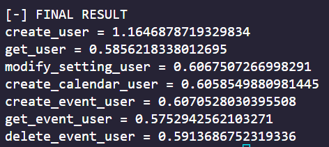
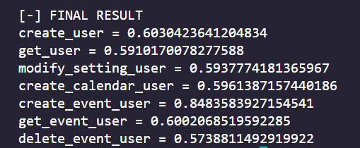

# FastAPI 🎯

## Description 📝
API created to allow communication between a Flutter Android application and a Python application.the API is very simple and is linked to a database hosted with the api on rail, in fact all requests go through the database.

### **Virgil-API** 🐝

## BenchMark 📋

| Database | Hosting |  FrameWork | Image | Average |
| --- | ----------- | --- | ----------- | ----------- | 
| MongoDB | Railway | fastAPI |  | 0,676
| MongoDB | Railway |  Flask |  | 0,628

## Notes 📖

I don' know if switching to fastAPI is a good choice because the difference is not mutch except for the more input control if you have your tips to give me tell me pls ❤️ 

## 💸 Credits and technologies used

Developer: Only me for now
Technologies:
 - Python
 - Fast
 - MongoDB
 - Pymongo

ps: follow me on [instagram](https://www.instagram.com/akiidjk) and [twitter](https://twitter.com/R3tr0_fj) contact me for help or support
