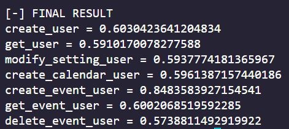

## BenchMark 📋

| Database | Hosting |  FrameWork | Image | Average |
| --- | ----------- | --- | ----------- | ----------- | 
| MongoDB | Railway | fastAPI |  | 0,676
| MongoDB | Railway |  Flask |  | 0,628

